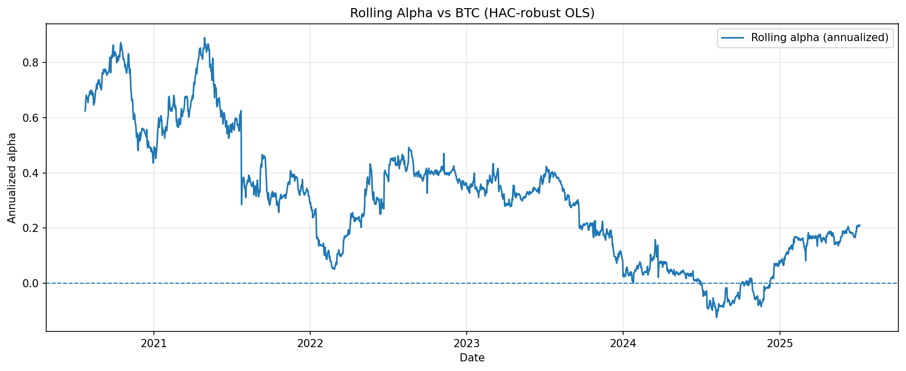
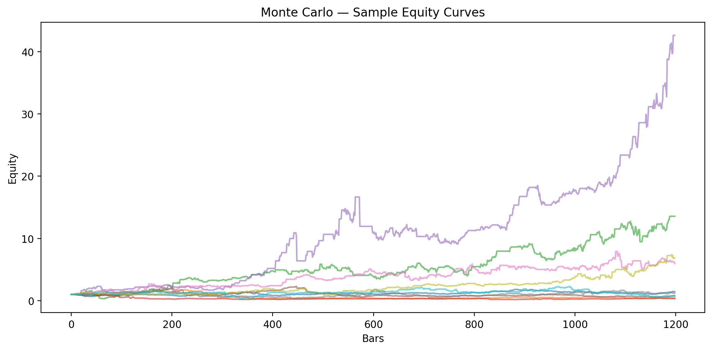

# BTC/USDT — EGARCH Variance-Breach Backtest

A quantitative research implementation of a **variance-breach long strategy** on BTC/USDT. The model uses **EGARCH(1,1)** (Student-t) to produce **out-of-sample one-step-ahead** variance forecasts and executes **next-bar** with **fee-aware** P&L.

## 🔧 Strategy Logic
- **Model:** EGARCH(1,1) with Student-t errors on BTC **log returns**; expanding window; **re-fit every 30 bars**.
- **Forecast:** use the **one-step-ahead** variance forecast available at bar *t*.
- **Signal (variance breach):** go long when `squared_return_t > forecast_variance_t`.
- **Execution:** if flat, **enter on the next bar** after the breach (prevents look-ahead).
- **Exits:**
  - **Take-profit:** **+8%** vs. entry.
  - **Vol-adjusted stop (log space):** exit when `log(price/entry) ≤ −α·σ_t`, with **α = 5.1** and **σ_t** the EGARCH-forecast stdev.
- **Costs:** **5 bps per side** on entry and exit.
- **Benchmark:** normalized **buy-and-hold**.
- **Annualization:** inferred from the index (supports **252** business-day, **365** calendar-day, or **52** weekly).

> **Robustness & Reporting**
> - Paired **circular block bootstrap** for ΔSharpe (CIs & p-values)  
> - **Pre- vs Post-2022** regime split metrics  
> - **Effective sample size (ESS)** for dependent returns  
> - Sanity checks for **next-bar entry** and **same-bar entry/exit**  
> - Auto-exported plots and Markdown **metrics tables** injected between README tags

---

## 📂 Project Files
```text
.
├─ egarch.py
├─ BTCUSDTmergeddataset.csv
├─ images/
│  ├─ egarch_trades.png
│  ├─ egarch_equity.png
│  ├─ egarch_drawdown.png
│  ├─ egarch_volatility.png
│  ├─ strategy_vs_buyhold.csv
│  ├─ strategy_vs_buyhold.md
│  ├─ robustness_checks.md
│  ├─ stationary_bootstrap_sensitivity.md
│  ├─ deflated_sharpe_ratio.md
│  └─ alpha_beta_regression.md
└─ README.md

---

## ⚙️ Installation
```
python -m venv .venv
# Windows: .venv\Scripts\activate
# macOS/Linux: source .venv/bin/activate
pip install -U pip
pip install pandas numpy matplotlib arch scipy
```
---

## requirements.txt`:

---

```
pandas
numpy
matplotlib
arch
```

---

## ▶️ Usage

---


```bash
python egarch.py
```

---

## 🔑 Key parameters
```
TP_PCT = 0.08        # 8% take-profit
ALPHA = 5            # volatility-adjusted stop multiplier
FEE = 0.0005         # 5 bps per side
RECALC_EVERY = 30    # EGARCH re-fit cadence
USE_WEEKLY = False   # True = weekly (W-MON), else daily

```

## ⚠️ Disclaimer
This project is **not** financial advice. Use at your own risk.

---

## Results

---

<!--- METRICS_TABLE_START --->
## 📈 Strategy vs Buy & Hold Metrics

|                              | EGARCH Strategy   | Buy & Hold   |
|:-----------------------------|:------------------|:-------------|
| Total Return                 | 6385.11%          | 2722.50%     |
| CAGR                         | 93.58%            | 69.69%       |
| Sharpe Ratio (annualize=365) | 1.5070            | 1.1459       |
| Max Drawdown                 | -54.76%           | -76.63%      |
| Trades                       | 82                | —            |
| Win Rate                     | 84.15%            | —            |
| Avg Trade PnL                | 5.95%             | —            |
<!--- METRICS_TABLE_END --->

---

<!--- ROBUSTNESS_TABLE_START --->
## 🛡️ Robustness & Validation Checks

| Check                                        | Result                      | Notes                                       |
|:---------------------------------------------|:----------------------------|:--------------------------------------------|
| Transaction costs modeled                    | 5.0 bps per side            | Applied on entries and exits.               |
| Execution lag                                | Next-bar                    | Breach detected at t, enter at t+1 if flat. |
| Walk-forward re-fitting                      | EGARCH re-fit every 30 bars | Burn-in=400; Student-t innovations.         |
| Annualization inference                      | k=365                       | Detected from index frequency/fallback.     |
| Missing weeks (if weekly)                    | 0                           | Data integrity check on W-MON grid.         |
| Next-bar entry violations                    | 0                           | Any entry without prior-bar breach.         |
| Next-bar entry violations (flat at t-1 only) | 0                           | Stricter condition; should be ~0.           |
| Same-bar entry/exit trades                   | 0                           | Typically due to forced close.              |
| Forced closes at final bar                   | 1                           | Honest stats when position open at end.     |
| Effective sample size (returns)              | Strat=2278, B&H=2093        | Accounts for autocorrelation.               |
| Data frequency                               | Daily                       | Controlled via USE_WEEKLY.                  |

### Bootstrap ΔSharpe (Strategy − Buy & Hold)

| Regime      |   Delta_Sharpe |   CI_Low |   CI_High |   p_two_sided |   p_one_sided_pos |
|:------------|---------------:|---------:|----------:|--------------:|------------------:|
| Full Sample |          0.361 |   -0.066 |     0.788 |         0.097 |             0.05  |
| Pre-2022    |          0.501 |   -0.24  |     1.278 |         0.204 |             0.102 |
| Post-2022   |          0.241 |   -0.234 |     0.671 |         0.305 |             0.155 |
<!--- ROBUSTNESS_TABLE_END --->


### Strategy Trades


---

### Equity Curve


---

### Drawdowns


---

### Returns vs EGARCH Volatility


<!-- refresh 2025-08-19T18:23:43 -->

<!-- refresh 2025-08-19T18:28:57 -->
>>>>>>> 62a07a87014d617fe1964283ec46ef3f46340102

<!--- STATIONARY_BOOTSTRAP_START --->
## 🔁 Stationary Bootstrap ΔSharpe Sensitivity

|   L (mean block) |   ΔSharpe |   CI_low |   CI_high |   p_two |   p_one(Δ>0) |
|-----------------:|----------:|---------:|----------:|--------:|-------------:|
|                5 |    0.3611 |  -0.0597 |    0.7978 |   0.099 |       0.0525 |
|               10 |    0.3611 |  -0.0572 |    0.804  |   0.098 |       0.0495 |
|               20 |    0.3611 |  -0.0487 |    0.7648 |   0.083 |       0.0425 |
<!--- STATIONARY_BOOTSTRAP_END --->


<!--- DSR_START --->
## 🧪 Deflated Sharpe Ratio (DSR)

- Frequency k = **365**
- Assumed trials (tuning breadth) = **20**

### Strategy vs Buy & Hold

| Metric | Value |
|---|---|
| SR_strat | 1.5070 |
| SR_bh | 1.1459 |
| DSR z-score | 53.903 |
| p-value | 0.0000 |
| T (obs) | 2306 |
| skew | 0.425 |
| excess kurtosis | 5.122 |

### Alpha-series (strategy − B&H)

| Metric | Value |
|---|---|
| SR_alpha | 0.1598 |
| DSR z-score | -1.646 |
| p-value | 0.9502 |
| T (obs) | 2306 |
| skew | 3.107 |
| excess kurtosis | 94.328 |

<!--- DSR_END --->
<!--- ALPHA_BETA_START --->
## 📎 Alpha vs Beta Regression (HAC-robust)

- Periodicity k = **365** (annualization)
- HAC lags = **14**; N = **2306**

| Metric | Value |
|---|---|
| Alpha (per period) | 0.000823 |
| Alpha (annualized) | 30.05% |
| Alpha 95% CI (annualized) | [7.13%, 52.97%] |
| t-stat (alpha) | 2.569 |
| p-value (alpha) | 0.0102 |
| Beta to BTC | 0.675 |
| t-stat (beta) | 13.330 |
| p-value (beta) | 0.0000 |
| R² | 0.6755 |

<!--- ALPHA_BETA_END --->

<!--- ROLLING_ALPHA_START --->
## 🔄 Rolling Alpha vs BTC

Window = **500** bars; annualization **k=365**.



<!--- ROLLING_ALPHA_END --->
<!--- MONTE_CARLO_START --->
## 🎲 Monte Carlo Stress Test (auto-updated)
_Last refreshed: **2025-08-21 20:13 UTC**_

### Results (N=3000)
- Median Final Equity: 1.87×
- Median CAGR: 21.04%
- Median Sharpe: 0.64
- Median Max DD: -66.58%

**Quantiles**
- Final Equity — p05: 0.21× · median: 1.87× · p95: 13.19×
- CAGR — p05: -37.89% · median: 21.04% · p95: 119.15%
- Sharpe — p05: -0.27 · median: 0.64 · p95: 1.44
- Max DD — p05: -93.22% · median: -66.58% · p95: -39.06%

**Figures**
- 

<!--- MONTE_CARLO_END --->


