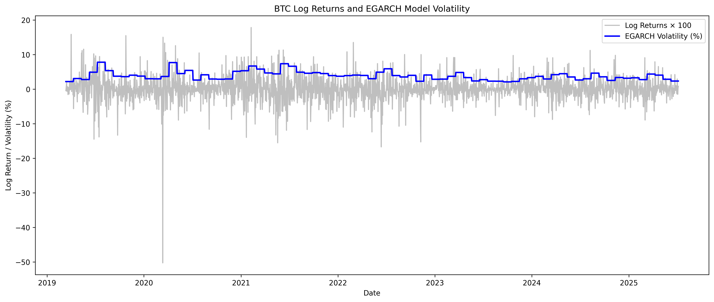

# BTC/USDT EGARCH Variance-Breach Backtest

This project implements and backtests a **variance-breach trading strategy** on BTC/USDT using the **EGARCH(1,1)** volatility model from the `arch` package.

**Strategy logic**:
- Fits an EGARCH model to BTC log returns.
- Detects **variance breaches** (when squared returns exceed model variance).
- Goes **long** on a breach.
- Exits at **+17% take-profit** or **−3% stop-loss**.
- Compares performance to a **buy-and-hold** benchmark.

---

## 📂 Project Files
```
.
├─ egarch.py                  # Main Python script
├─ BTCUSDTmergeddataset.csv   # Input dataset (timestamp, close)
└─ README.md                  # This file
```

---

## 📊 Features
- EGARCH(1,1) volatility estimation
- Variance-breach signal generation
- Trade execution logic with TP & SL
- Equity curve tracking
- Performance metrics:
  - Total return
  - CAGR
  - Sharpe ratio
  - Max drawdown
  - Win rate
- Plots:
  - Price with breaches & trades
  - Strategy vs buy-and-hold equity
  - EGARCH volatility vs returns

---

## 📑 Data Requirements
The CSV must contain:
- `timestamp` — in **day-first** format
- `close` — closing price

Duplicate timestamps are removed.  
Missing ISO weeks are reported in the terminal for awareness.

---

## ⚙️ Installation
```bash
python -m venv .venv

# Activate the environment:
# Windows:
.venv\Scripts\activate
# macOS/Linux:
source .venv/bin/activate

pip install -U pip
pip install pandas numpy matplotlib arch
```

**Optional** `requirements.txt`:
```
pandas
numpy
matplotlib
arch
```

---

## ▶️ Usage
```bash
python egarch.py
```
The script will:
- Output performance metrics in the terminal.
- Display plots for price action, breaches, trades, and equity curves.

---


## 📝 Notes
- All thresholds (e.g., TP = 17%, SL = 3%) are defined in `egarch.py` and can be changed.
- No transaction costs, slippage, or liquidity constraints are modeled.
- For **research and educational purposes only**.

---

## ⚠️ Disclaimer
This project is **not** financial advice. Use at your own risk.

---

## Results

---

## 📈 Strategy vs Buy & Hold Metrics

<!--- METRICS_TABLE_START --->
## 📈 Strategy vs Buy & Hold Metrics

|                       | EGARCH Strategy   | Buy & Hold   |
|:----------------------|:------------------|:-------------|
| Total Return          | 508.49%           | 1129.77%     |
| CAGR                  | 27.54%            | 40.23%       |
| Sharpe Ratio (weekly) | 0.2735            | 0.1910       |
| Max Drawdown          | -59.25%           | -76.63%      |
| Trades                | 178               | —            |
| Win Rate              | 27.53%            | —            |
| Avg Trade PnL         | 1.66%             | —            |
<!--- METRICS_TABLE_END --->

---

### Strategy Trades


---

### Equity Curve


---

### Drawdowns


---

### Returns vs EGARCH Volatility

